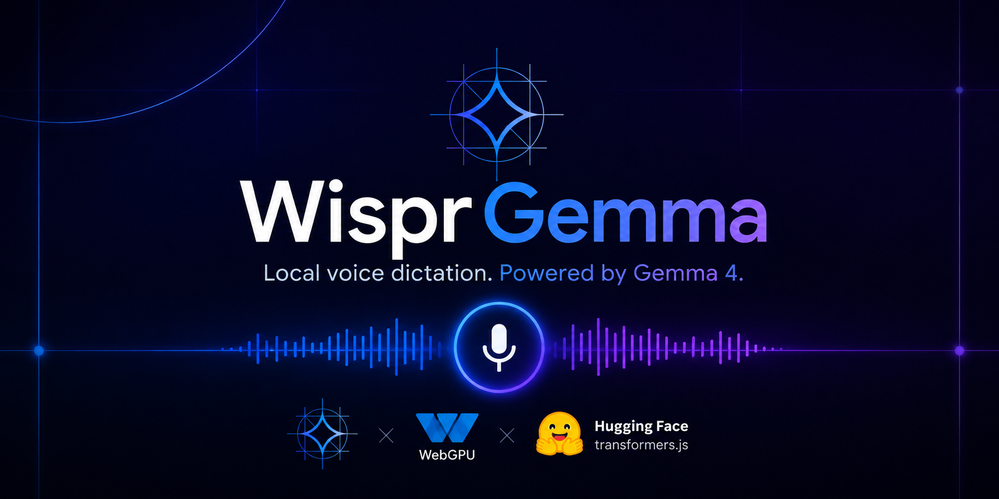

# WisprGemma

Local-first multilingual dictation powered by **Gemma 4 E2B**. Speak in any language, get polished text. Audio never leaves your device.


WisprGemma is a WisprFlow-style dictation tool that runs entirely in the browser on WebGPU. I built it for anyone who wants fast voice-to-text without sending audio to a cloud API: no subscription, no API key, works offline after a one-time model download (~3.5 GB, q4f16).

One Gemma 4 model handles the full pipeline in a single pass: speech recognition, cleanup, and rewriting. No Whisper, no backend.

## Output modes

Pick a mode before you speak. Each one is a different prompt to the same model, not a separate pipeline.

| Mode | What you get | Best for |
|------|--------------|----------|
| **Clean dictation** | Transcript with fillers removed, false starts cut, punctuation fixed. Spoken commands like "new paragraph" or "make that a bullet list" are applied, not transcribed. | Notes, docs, general dictation |
| **Verbatim** | Exact transcript as spoken, no cleanup | Capturing raw speech, interviews |
| **Polished email** | Rewritten as a concise, professional email body with grammar and punctuation fixed | Drafting emails by voice |
| **Any language → English** | Transcribes speech in any language and outputs polished English | Multilingual input, translation-style dictation |

## Key features

| | Web app ([`web/`](web/)) | Chrome extension ([`extension/`](extension/)) |
|---|--------------------------|------------------------------------------------|
| **Dictation** | Hold button or **Space**, streaming output | Side panel + **Option** push-to-talk on any page |
| **Insert text** | Copy from output area | Inserts into focused input, textarea, or contenteditable |
| **Privacy** | 100% on-device inference | Same: audio never leaves your machine |
| **Stats** | Words dictated, WPM, time saved, streak, 14-day chart | Separate dashboard for extension usage |
| **Offline** | Works after first model load | Same (separate cache per origin) |
| **Extras** | Editorial UI, per-utterance latency stats | Dictation history, mic permission helper tab |

## Quick start

### Web app

```sh
npm run serve:web
```

Open http://localhost:3000, click **Load model**, allow the microphone, hold Space and speak.

Requires Chrome or Edge 121+ with WebGPU enabled. First load downloads ~3.5 GB, then spends a few minutes uploading weights to the GPU.

### Chrome extension

1. Open `chrome://extensions`, enable **Developer mode**
2. **Load unpacked** → select the `extension/` folder
3. Click the WisprGemma icon, load the model, allow the microphone
4. If mic access fails in the side panel, follow the permission tab that opens automatically
5. Focus a text field on any page and dictate

### Optional: local model server

```sh
npm run download-model
```

Downloads weights into `web/models/` and serves them on port 8975. Leave it running while developing. Both the web app and extension auto-detect it.

## How it works

```
Mic (MediaRecorder)
  → decode to 16 kHz mono Float32
  → worker.js (Transformers.js + Gemma 4 E2B on WebGPU)
  → streamed tokens back to UI
  → display / insert into page / log stats
```

Vanilla HTML/CSS/JS, no build step. A module **Web Worker** runs inference so the UI stays responsive while a 3.5 GB model loads.

**Model:** [`onnx-community/gemma-4-E2B-it-ONNX`](https://huggingface.co/onnx-community/gemma-4-E2B-it-ONNX), q4f16, WebGPU via Transformers.js 4.2.0. Weights download from Hugging Face Hub on first load, then cache in the browser. Clips longer than 30 seconds are split into segments automatically (Gemma 4 audio limit).

The extension adds MV3-specific workarounds: vendored Transformers.js and ONNX Runtime WASM, plus a one-time mic permission page (Chrome cannot prompt inside the side panel).

## Tech stack

| Layer | Technology |
|-------|------------|
| Model | Gemma 4 E2B instruction-tuned (`gemma-4-E2B-it`) |
| Inference | [Transformers.js](https://huggingface.co/docs/transformers.js) 4.2.0 |
| Runtime | WebGPU (Chrome / Edge 121+) |
| Model format | ONNX, q4f16 quantized |
| Web app | HTML, CSS, vanilla JS, ES module Web Worker |
| Extension | Chrome Manifest V3, Side Panel API, content scripts |
| Audio | MediaRecorder → Web Audio API decode → 16 kHz mono Float32 |
| Storage | `localStorage` (stats, dictation history in extension) |

## Repository layout

```
wisprgemma/
├── web/                   Web app + stats dashboard
├── extension/             Chrome MV3 extension
├── package.json           Convenience scripts
└── serve.json             Static server config
```

See [`web/README.md`](web/README.md) and [`extension/README.md`](extension/README.md) for package-specific notes.

## Privacy

Audio is captured locally, processed locally, and never sent to a server. Stats and history live in browser storage on your machine only.
